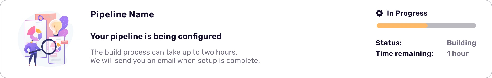

# TechEquipt Next.js / Frontend assessment

## Description

The task is to create a storybook.js "story" containing a component based on the design in `component.jpg`



Additional notes:

- The component should be responsive and appropriately collapse on smaller screen sizes
- The component should have a dark and light mode. We will let you decide how to best implement this
- The graphic on the left can be found in `graphic.svg`
- The design is given as 1100x176 resolution for reference

## Getting Started

This is a [Next.js](https://nextjs.org/) project bootstrapped with [`create-next-app`](https://github.com/vercel/next.js/tree/canary/packages/create-next-app).
First, run the development server:

```bash
npm run dev
```

## Storybook

To open the storybook development server run

```base
npm run storybook
```
